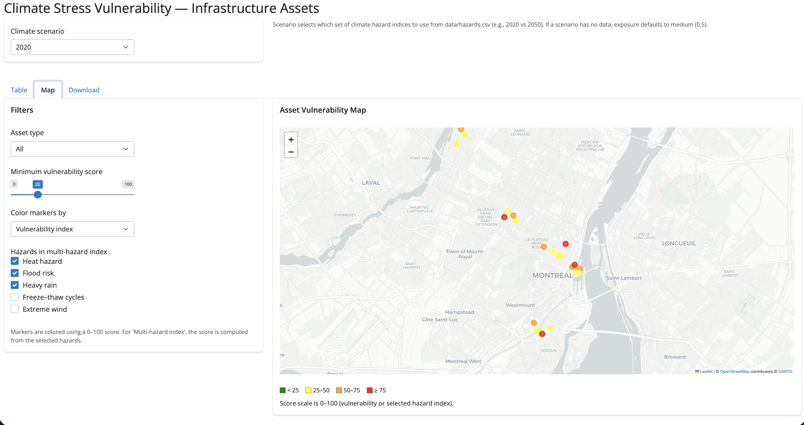
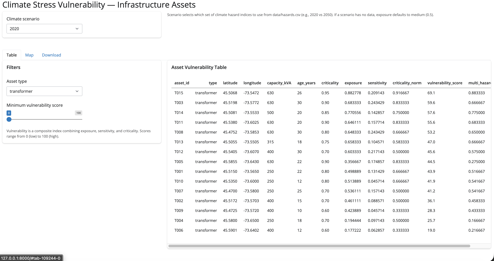
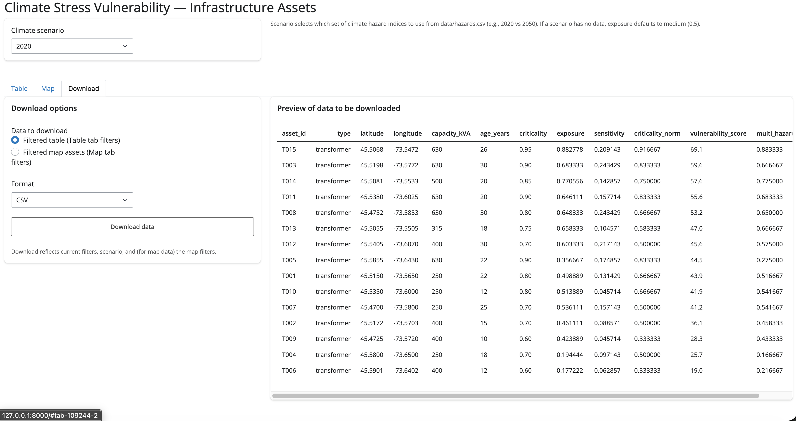

# Climate Infrastructure Risk Explorer

An interactive Shiny for Python dashboard that maps and analyzes climate-stress vulnerability for electrical infrastructure such as transformers, substations, and buildings.

## Key Features

- Computes a composite vulnerability index (0–100) from exposure, sensitivity, and criticality.
- Supports multiple future climate scenarios (2020, 2030, 2050, 2080).
- Interactive map with color-coded markers and hazard-based coloring.
- Multi-hazard index builder where users choose which hazards to include.
- Filterable table view with sorting.
- Downloadable filtered datasets (CSV).

## Installation

### Clone the repository
        git clone https://github.com/TonyMPeluso/climate_infra_risk.git
        cd climate_infra_risk
### Create and activate the virtual environment
        python3 -m venv .venv
        source .venv/bin/activate
### Install dependencies
        pip install -r requirements.txt
### Run the application
        python3 -m shiny run --reload app/app_shiny.py

The app will run at:

http://127.0.0.1:8000

## Project Structure

```
climate_infra_risk/
├── app/
│   └── app_shiny.py
├── data/
│   ├── assets.csv
│   ├── hazards.csv
│   ├── climate_scenario_2020.csv
│   ├── climate_scenario_2030.csv
│   ├── climate_scenario_2050.csv
│   └── climate_scenario_2080.csv
├── img/
│   ├── download_tab.png
│   ├── map_tab.png
│   ├── table_tab.png
├── src/
│   ├── load_assets.py
│   └── vulnerability.py
├── requirements.txt
├── README.md
└── LICENSE
```


## Data Description

### assets.csv
Contains infrastructure assets with fields such as:
- asset_id
- type
- latitude
- longitude
- capacity_kVA
- age_years
- criticality
- exposure
- sensitivity
- freeze_thaw
- heavy_rain
- flood_risk
- heat_index
- wind_extreme

### hazards.csv
Contains climate hazard projections for each scenario year:
- freeze_thaw
- heavy_rain
- flood_risk
- heat_index
- wind_extreme

### scenarios.csv
Defines available climate scenario years:
- 2020
- 2030
- 2050
- 2080

## Methodology

### Vulnerability Methodology
Composite Vulnerability Score
vulnerability_score = 100 * (
    0.5 * criticality_norm +
    0.3 * exposure +
    0.2 * sensitivity
)

### Multi-Hazard Index
Average of selected hazard columns:
        multi_hazard_index = average(selected hazards)

## Screenshots

### Map View


### Table View


### Download View


Contact

Tony Peluso, PhD
Energy Modelling and Climate Risk Analytics
Montreal, QC
